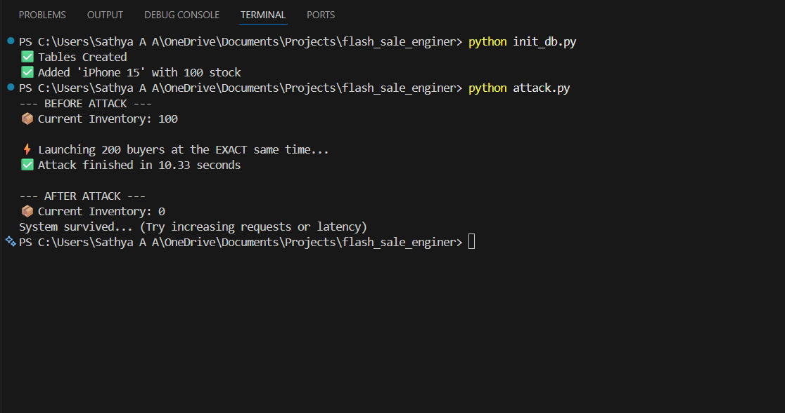

# High-Concurrency Flash Sale Engine ⚡

A backend system designed to handle high-traffic flash sales without data corruption. It solves the classic **Race Condition** problem using **Redis Distributed Locks** and **Asynchronous Python**.

*(Proof of Consistency: 200 concurrent requests processed, 0 oversold items)*

## 🛑 The Problem
In standard database transactions, concurrent requests can read the same inventory count before a purchase is committed. 
* **Scenario:** 100 items are in stock. 200 users click "Buy" at the exact same millisecond.
* **The Bug:** Without locking, multiple users read "Stock: 100" simultaneously. The database receives 200 "decrement by 1" commands, but due to the "Lost Update" phenomenon, the final inventory might end up at 85 or 90 instead of 0.
* **The Business Impact:** You oversell the product by 15-20%, leading to cancelled orders and angry customers.

## ✅ The Solution
This project implements a **pessimistic locking strategy** using Redis:
1.  **FastAPI (Async):** Handles thousands of concurrent connections using a non-blocking event loop.
2.  **Redis Distributed Lock:** Before checking inventory, a user must acquire a unique lock key (`lock:product:{id}`).
3.  **TTL (Time-To-Live):** Locks automatically expire after 20 seconds to prevent "Zombie Locks" if a server crashes.
4.  **Queueing:** Late requests wait in line for the lock rather than crashing the database with connection attempts.

## 🛠️ Tech Stack
* **Language:** Python 3.10+
* **Framework:** FastAPI
* **Database:** PostgreSQL (AsyncPG)
* **Cache/Locking:** Redis (Asyncio)
* **DevOps:** Docker & Docker Compose

## 🚀 How to Run Locally

### 1. Start Infrastructure
Run Redis and PostgreSQL in Docker containers:
```bash
docker-compose up -d

2. Install Dependencies
Bash

pip install -r requirements.txt
3. Initialize Database
Create tables and seed the DB with a dummy product (iPhone 15, 100 stock):

Bash

python init_db.py
4. Run the Server
Bash

uvicorn main:app --reload
🧪 Testing the Race Condition
I have included an attack script that acts like a DDoS attack of buyers.

To Run the Load Test:

Bash

python attack.py
Expected Output:

Without Lock (Naive): Inventory ends at 85 (Data Corruption).

With Lock (Smart): Inventory ends at 0 (Perfect Consistency).
